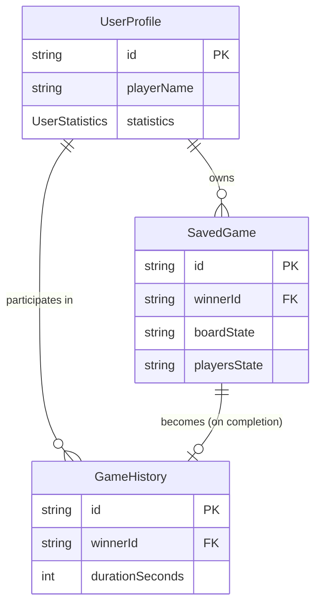

# Data Model: Project Setup Configuration & Persistence

**Feature**: 001-project-setup
**Date**: 2025-12-25
**Author**: Farhat Naz
**Status**: Phase 1 - Design Complete

---

## Overview

This data model defines the **configuration and persistence structures** for the Ludo Mobile Game project setup. Since this feature focuses on development environment (not the game engine itself), the data model covers:

1. **App Settings**: User preferences (audio, haptics)
2. **User Profile**: Player identity and statistics
3. **Saved Game State**: Game resumption data (future feature)

**Storage Strategy** (from research.md):
- **AsyncStorage**: Simple key-value data (settings, profile)
- **expo-sqlite**: Complex relational data (saved games, history)

---

## 1. App Settings (AsyncStorage)

### Entity: AppSettings

**Purpose**: Persist user preferences for audio, haptics, and future configuration options.

**Storage**: AsyncStorage key `'app-settings'`

### Schema

```typescript
interface AppSettings {
  /**
   * Global audio toggle (all sound effects)
   * Default: true
   */
  audioEnabled: boolean;

  /**
   * Global haptic feedback toggle (vibrations)
   * Default: true (if device supports)
   */
  hapticsEnabled: boolean;

  /**
   * Theme preference (future enhancement)
   * Default: 'light'
   */
  theme?: 'light' | 'dark';

  /**
   * Schema version for migration compatibility
   * Default: 1
   */
  version: number;
}
```

### Default Values

```typescript
const DEFAULT_SETTINGS: AppSettings = {
  audioEnabled: true,
  hapticsEnabled: true,
  theme: 'light',
  version: 1,
};
```

### Validation Rules

| Field | Rule | Enforcement |
|-------|------|-------------|
| `audioEnabled` | Must be boolean | Runtime type check + Zod schema |
| `hapticsEnabled` | Must be boolean | Runtime type check + Zod schema |
| `theme` | Must be 'light' or 'dark' (if present) | Zod enum validation |
| `version` | Must be positive integer | Zod schema |

### Persistence Contract

```typescript
interface ISettingsStore {
  /**
   * Load settings from AsyncStorage
   * Returns default settings if none exist
   */
  loadSettings(): Promise<AppSettings>;

  /**
   * Save settings to AsyncStorage
   * Validates settings before persisting
   */
  saveSettings(settings: AppSettings): Promise<void>;

  /**
   * Reset settings to defaults
   */
  resetSettings(): Promise<void>;
}
```

### Migration Strategy

When `version` field changes:

```typescript
async function migrateSettings(stored: any): Promise<AppSettings> {
  if (!stored.version || stored.version < 1) {
    // v0 → v1: Add version field
    return { ...DEFAULT_SETTINGS, ...stored, version: 1 };
  }

  // Future migrations
  // if (stored.version === 1) { ... }

  return stored;
}
```

---

## 2. User Profile (AsyncStorage)

### Entity: UserProfile

**Purpose**: Store player identity and game statistics for single-device play.

**Storage**: AsyncStorage key `'user-profile'`

**Note**: In v1.0 (offline-only), this is device-local. In v2.0 (online multiplayer), sync with backend.

### Schema

```typescript
interface UserProfile {
  /**
   * Unique identifier (UUID v4)
   * Generated on first app launch
   */
  id: string;

  /**
   * Player display name
   * Default: "Player"
   * Editable in settings screen
   */
  playerName: string;

  /**
   * Game statistics
   */
  statistics: UserStatistics;

  /**
   * Profile creation timestamp (ISO 8601)
   */
  createdAt: string;

  /**
   * Last updated timestamp (ISO 8601)
   */
  updatedAt: string;

  /**
   * Schema version for migration
   */
  version: number;
}

interface UserStatistics {
  /**
   * Total games started
   * Increments on game start (includes abandoned games)
   */
  gamesPlayed: number;

  /**
   * Total games won
   * Increments when player achieves win condition
   */
  gamesWon: number;

  /**
   * Total games lost
   * Increments when opponent achieves win condition
   */
  gamesLost: number;

  /**
   * Total games abandoned (quit before completion)
   * Future feature for analytics
   */
  gamesAbandoned?: number;

  /**
   * Win rate percentage (calculated field, not stored)
   * Formula: (gamesWon / (gamesWon + gamesLost)) * 100
   */
  // winRate: number; // Computed, not persisted
}
```

### Default Values

```typescript
const DEFAULT_PROFILE: UserProfile = {
  id: uuidv4(), // Generated on first launch
  playerName: 'Player',
  statistics: {
    gamesPlayed: 0,
    gamesWon: 0,
    gamesLost: 0,
    gamesAbandoned: 0,
  },
  createdAt: new Date().toISOString(),
  updatedAt: new Date().toISOString(),
  version: 1,
};
```

### Validation Rules

| Field | Rule | Enforcement |
|-------|------|-------------|
| `id` | Valid UUID v4 | Zod uuid() schema |
| `playerName` | 1-20 characters, alphanumeric + spaces | Zod string().min(1).max(20).regex(/^[a-zA-Z0-9 ]+$/) |
| `statistics.*` | Non-negative integers | Zod number().int().min(0) |
| `createdAt` | Valid ISO 8601 datetime | Zod string().datetime() |
| `updatedAt` | Valid ISO 8601 datetime | Zod string().datetime() |

### Derived Fields

```typescript
function calculateWinRate(profile: UserProfile): number {
  const { gamesWon, gamesLost } = profile.statistics;
  const totalDecided = gamesWon + gamesLost;

  if (totalDecided === 0) return 0;

  return Math.round((gamesWon / totalDecided) * 100);
}
```

### Persistence Contract

```typescript
interface IProfileStore {
  /**
   * Load user profile from AsyncStorage
   * Creates default profile if none exists
   */
  loadProfile(): Promise<UserProfile>;

  /**
   * Update user profile (name, statistics)
   */
  updateProfile(updates: Partial<UserProfile>): Promise<void>;

  /**
   * Increment game statistics
   */
  incrementStat(stat: 'gamesPlayed' | 'gamesWon' | 'gamesLost' | 'gamesAbandoned'): Promise<void>;

  /**
   * Reset statistics (keep name and ID)
   */
  resetStatistics(): Promise<void>;
}
```

---

## 3. Saved Game State (SQLite)

### Entity: SavedGame

**Purpose**: Persist active game state for save/resume functionality (future feature in v1.1+).

**Storage**: SQLite table `saved_games`

**Note**: This is a **future feature**. The schema is defined now to guide game engine design (ensuring game state is serializable).

### SQLite Schema

```sql
CREATE TABLE IF NOT EXISTS saved_games (
  -- Primary key (UUID v4)
  id TEXT PRIMARY KEY NOT NULL,

  -- Game configuration
  mode TEXT NOT NULL CHECK(mode IN ('single', 'multi')),
  player_count INTEGER NOT NULL CHECK(player_count BETWEEN 2 AND 4),

  -- Serialized game state (JSON)
  board_state TEXT NOT NULL, -- JSON snapshot of Board class
  players_state TEXT NOT NULL, -- JSON snapshot of Player[] array
  current_turn INTEGER NOT NULL CHECK(current_turn >= 0),

  -- Metadata
  created_at INTEGER NOT NULL, -- Unix timestamp (seconds)
  updated_at INTEGER NOT NULL, -- Unix timestamp (seconds)

  -- Game progress
  is_completed INTEGER NOT NULL DEFAULT 0 CHECK(is_completed IN (0, 1)), -- Boolean (0 = in progress, 1 = finished)
  winner_id TEXT -- Player ID (NULL if in progress)
);

CREATE INDEX idx_saved_games_mode ON saved_games(mode);
CREATE INDEX idx_saved_games_updated ON saved_games(updated_at DESC);
```

### TypeScript Schema

```typescript
interface SavedGame {
  /**
   * Unique game ID (UUID v4)
   */
  id: string;

  /**
   * Game mode
   */
  mode: 'single' | 'multi';

  /**
   * Number of players (2-4)
   */
  playerCount: 2 | 3 | 4;

  /**
   * Serialized board state (JSON string)
   * Deserialized to Board class instance
   */
  boardState: string; // JSON of BoardState

  /**
   * Serialized players array (JSON string)
   * Deserialized to Player[] array
   */
  playersState: string; // JSON of PlayerState[]

  /**
   * Current turn index (0-based)
   */
  currentTurn: number;

  /**
   * Creation timestamp (Unix seconds)
   */
  createdAt: number;

  /**
   * Last update timestamp (Unix seconds)
   */
  updatedAt: number;

  /**
   * Game completion flag
   */
  isCompleted: boolean;

  /**
   * Winner player ID (null if in progress)
   */
  winnerId: string | null;
}

/**
 * Serializable board state (from game engine)
 * This ensures game engine classes are JSON-serializable
 */
interface BoardState {
  positions: Record<number, TokenPosition>; // 0-71 board positions
  safeZones: Record<PlayerColor, number[]>; // Safe zone positions per player
  homeZones: Record<PlayerColor, number[]>; // Home positions per player
}

interface PlayerState {
  id: string;
  color: PlayerColor;
  tokens: TokenState[];
  isAI: boolean;
}

interface TokenState {
  id: string;
  position: number; // -1 = home, 0-71 = board, 72+ = finished
  isActive: boolean; // Has left home
}

type PlayerColor = 'red' | 'blue' | 'green' | 'yellow';
```

### Validation Rules

| Field | Rule | SQLite Constraint |
|-------|------|-------------------|
| `id` | Valid UUID v4 | PRIMARY KEY NOT NULL |
| `mode` | 'single' or 'multi' | CHECK(mode IN ('single', 'multi')) |
| `playerCount` | 2, 3, or 4 | CHECK(player_count BETWEEN 2 AND 4) |
| `boardState` | Valid JSON string | NOT NULL (validated in app) |
| `playersState` | Valid JSON string | NOT NULL (validated in app) |
| `currentTurn` | Non-negative integer | CHECK(current_turn >= 0) |
| `isCompleted` | Boolean (0 or 1) | CHECK(is_completed IN (0, 1)) |

### Persistence Contract

```typescript
interface IGameStateStore {
  /**
   * Save current game state
   */
  saveGame(game: SavedGame): Promise<void>;

  /**
   * Load saved game by ID
   */
  loadGame(id: string): Promise<SavedGame | null>;

  /**
   * List all saved games (most recent first)
   */
  listSavedGames(limit?: number): Promise<SavedGame[]>;

  /**
   * Delete saved game
   */
  deleteGame(id: string): Promise<void>;

  /**
   * Mark game as completed
   */
  completeGame(id: string, winnerId: string): Promise<void>;
}
```

### Serialization Strategy

**Game Engine Classes Must Be Serializable**:

```typescript
// Game engine classes implement toJSON() and fromJSON()
class Board {
  toJSON(): BoardState {
    return {
      positions: this.positions,
      safeZones: this.safeZones,
      homeZones: this.homeZones,
    };
  }

  static fromJSON(state: BoardState): Board {
    const board = new Board();
    board.positions = state.positions;
    board.safeZones = state.safeZones;
    board.homeZones = state.homeZones;
    return board;
  }
}

class Player {
  toJSON(): PlayerState {
    return {
      id: this.id,
      color: this.color,
      tokens: this.tokens.map(t => t.toJSON()),
      isAI: this.isAI,
    };
  }

  static fromJSON(state: PlayerState): Player {
    const player = new Player(state.id, state.color, state.isAI);
    player.tokens = state.tokens.map(Token.fromJSON);
    return player;
  }
}
```

---

## 4. Game History (SQLite, Future Feature)

### Entity: GameHistory

**Purpose**: Track completed games for statistics and analytics (v1.1+ feature).

**Storage**: SQLite table `game_history`

### SQLite Schema

```sql
CREATE TABLE IF NOT EXISTS game_history (
  -- Primary key
  id TEXT PRIMARY KEY NOT NULL,

  -- Winner information
  winner_id TEXT NOT NULL, -- Player ID from UserProfile

  -- Game metadata
  mode TEXT NOT NULL CHECK(mode IN ('single', 'multi')),
  player_count INTEGER NOT NULL CHECK(player_count BETWEEN 2 AND 4),

  -- Performance metrics
  duration_seconds INTEGER NOT NULL CHECK(duration_seconds > 0),
  total_turns INTEGER NOT NULL CHECK(total_turns > 0),

  -- Timestamps
  started_at INTEGER NOT NULL,
  completed_at INTEGER NOT NULL
);

CREATE INDEX idx_game_history_winner ON game_history(winner_id);
CREATE INDEX idx_game_history_completed ON game_history(completed_at DESC);
```

### TypeScript Schema

```typescript
interface GameHistory {
  id: string;
  winnerId: string;
  mode: 'single' | 'multi';
  playerCount: 2 | 3 | 4;
  durationSeconds: number;
  totalTurns: number;
  startedAt: number; // Unix timestamp
  completedAt: number; // Unix timestamp
}
```

### Persistence Contract

```typescript
interface IGameHistoryStore {
  /**
   * Record completed game
   */
  recordGame(game: GameHistory): Promise<void>;

  /**
   * Get player's game history (most recent first)
   */
  getPlayerHistory(playerId: string, limit?: number): Promise<GameHistory[]>;

  /**
   * Get win/loss statistics for player
   */
  getPlayerStats(playerId: string): Promise<{
    totalGames: number;
    wins: number;
    losses: number;
    averageDuration: number;
  }>;
}
```

---

## 5. Data Model Summary

### Storage Distribution

| Entity | Storage | Size Estimate | Persistence Frequency |
|--------|---------|---------------|----------------------|
| **AppSettings** | AsyncStorage | <1KB | On user change (rare) |
| **UserProfile** | AsyncStorage | <2KB | On game completion (per game) |
| **SavedGame** | SQLite | ~10-20KB per game | On game save action (optional) |
| **GameHistory** | SQLite | ~500 bytes per game | On game completion (per game) |

**Total Storage (v1.0)**: <100KB for 10 saved games + 100 completed games

### Entity Relationships



### Validation Library

**Selected**: [Zod](https://zod.dev/) for runtime type validation

**Rationale**:
- TypeScript-first (type inference)
- Lightweight (~8KB gzipped)
- Validates AsyncStorage data on load (prevents corruption)

**Example Schema**:

```typescript
import { z } from 'zod';

const AppSettingsSchema = z.object({
  audioEnabled: z.boolean(),
  hapticsEnabled: z.boolean(),
  theme: z.enum(['light', 'dark']).optional(),
  version: z.number().int().positive(),
});

// Runtime validation
async function loadSettings(): Promise<AppSettings> {
  const stored = await AsyncStorage.getItem('app-settings');
  const parsed = stored ? JSON.parse(stored) : DEFAULT_SETTINGS;

  // Throws ZodError if invalid
  return AppSettingsSchema.parse(parsed);
}
```

---

## 6. Migration Strategy

### AsyncStorage Migrations

**Version Field**: All AsyncStorage entities include a `version` field.

**Migration Flow**:

```typescript
async function migrateAsyncStorageData(key: string, currentVersion: number): Promise<void> {
  const stored = await AsyncStorage.getItem(key);
  if (!stored) return; // No data to migrate

  const parsed = JSON.parse(stored);
  const storedVersion = parsed.version || 0;

  if (storedVersion < currentVersion) {
    // Apply migrations sequentially
    let migrated = parsed;
    for (let v = storedVersion; v < currentVersion; v++) {
      migrated = await applyMigration(key, v, migrated);
    }

    await AsyncStorage.setItem(key, JSON.stringify(migrated));
  }
}

async function applyMigration(key: string, fromVersion: number, data: any): Promise<any> {
  switch (key) {
    case 'app-settings':
      if (fromVersion === 0) {
        // v0 → v1: Add version field
        return { ...data, version: 1 };
      }
      break;

    case 'user-profile':
      if (fromVersion === 0) {
        // v0 → v1: Add gamesAbandoned field
        return {
          ...data,
          statistics: { ...data.statistics, gamesAbandoned: 0 },
          version: 1,
        };
      }
      break;
  }

  return data;
}
```

### SQLite Migrations

**Schema Versioning**: Use SQLite `PRAGMA user_version` to track schema version.

**Migration Example**:

```typescript
async function migrateSQLite(db: SQLiteDatabase): Promise<void> {
  const currentVersion = await db.getFirstAsync<{ user_version: number }>(
    'PRAGMA user_version'
  );

  const version = currentVersion?.user_version || 0;

  if (version < 1) {
    // Migration 1: Create saved_games table
    await db.execAsync(`
      CREATE TABLE IF NOT EXISTS saved_games (
        id TEXT PRIMARY KEY NOT NULL,
        -- ... (schema above)
      );
      PRAGMA user_version = 1;
    `);
  }

  if (version < 2) {
    // Migration 2: Add game_history table
    await db.execAsync(`
      CREATE TABLE IF NOT EXISTS game_history (
        id TEXT PRIMARY KEY NOT NULL,
        -- ... (schema above)
      );
      PRAGMA user_version = 2;
    `);
  }
}
```

---

## 7. Testing Requirements

### Unit Tests (Data Model Validation)

**Files to Test**:
- `src/services/storage/SettingsStore.ts`
- `src/services/storage/ProfileStore.ts`
- `src/services/storage/GameStateStore.ts` (future)

**Test Cases**:

```typescript
// SettingsStore.test.ts
describe('SettingsStore', () => {
  test('loadSettings returns defaults when no stored data', async () => {
    const settings = await settingsStore.loadSettings();
    expect(settings).toEqual(DEFAULT_SETTINGS);
  });

  test('saveSettings validates schema before persisting', async () => {
    const invalid = { audioEnabled: 'not-a-boolean' };
    await expect(settingsStore.saveSettings(invalid)).rejects.toThrow(ZodError);
  });

  test('migration from v0 to v1 adds version field', async () => {
    // Mock AsyncStorage with v0 data
    await AsyncStorage.setItem('app-settings', JSON.stringify({ audioEnabled: true }));

    const settings = await settingsStore.loadSettings();
    expect(settings.version).toBe(1);
  });
});
```

### Integration Tests (SQLite Persistence)

```typescript
// GameStateStore.test.ts
describe('GameStateStore', () => {
  test('saveGame persists serializable game state', async () => {
    const game: SavedGame = {
      id: 'test-game-1',
      mode: 'single',
      playerCount: 2,
      boardState: JSON.stringify({ positions: {}, safeZones: {}, homeZones: {} }),
      playersState: JSON.stringify([{ id: 'p1', color: 'red', tokens: [], isAI: false }]),
      currentTurn: 0,
      createdAt: Date.now(),
      updatedAt: Date.now(),
      isCompleted: false,
      winnerId: null,
    };

    await gameStateStore.saveGame(game);
    const loaded = await gameStateStore.loadGame('test-game-1');

    expect(loaded).toEqual(game);
  });
});
```

---

## 8. Acceptance Criteria

From `spec.md` (FR-006, FR-007):

- [x] **FR-006**: Define configuration data structures (AppSettings, UserProfile)
  - ✅ AppSettings schema with audio, haptics, theme fields
  - ✅ UserProfile schema with ID, name, statistics

- [x] **FR-007**: Define persistence contracts (AsyncStorage, SQLite)
  - ✅ ISettingsStore interface for AppSettings
  - ✅ IProfileStore interface for UserProfile
  - ✅ IGameStateStore interface for SavedGame (future)

- [x] **Validation**: Zod schemas defined for runtime type checking
- [x] **Migrations**: Strategy documented for AsyncStorage and SQLite version upgrades
- [x] **Testing**: Unit test cases outlined for all persistence operations

---

**Phase 1 (Data Model)**: ✅ **COMPLETE**
**Next Step**: Generate API contracts in `contracts/` directory
**Approved By**: Farhat Naz
**Date**: 2025-12-25
